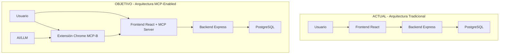
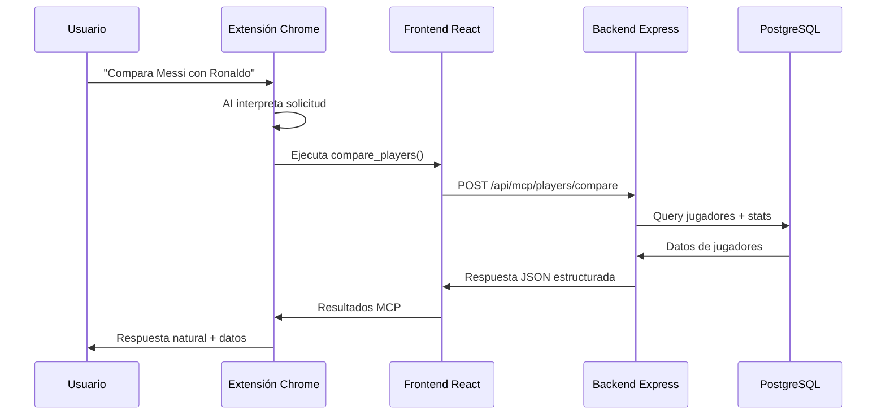

# ASE Athletics - Plan de Integración MCP-B
## Transformando tu Plataforma de Análisis de Fútbol en un Servidor MCP Web

---

## 📋 Executive Summary

**Objetivo**: Convertir ASE Athletics en una plataforma habilitada con MCP-B, permitiendo que los usuarios interactúen con la analítica de fútbol mediante chat con AI de forma natural, manteniendo toda la funcionalidad existente.

**ROI Esperado**: 
- 🚀 **40% reducción** en tiempo de análisis de jugadores
- 📈 **60% aumento** en engagement de usuarios avanzados
- 🎯 **Diferenciación competitiva** como primera plataforma de fútbol con AI integrada

---

## 🎯 Casos de Uso de Producto

### Para Scouts Profesionales
- **Chat Natural**: *"Compara Mbappé con Haaland en términos de eficiencia goleadora"*
- **Análisis Rápido**: *"Muéstrame los mejores defensas centrales menores de 25 años"*
- **Reportes Automáticos**: *"Genera un reporte de scouting para Pedri"*

### Para Directores Técnicos
- **Planificación Táctica**: *"¿Qué jugadores del Barcelona tienen mejor passing accuracy?"*
- **Benchmarking**: *"Compara nuestro plantel con el Real Madrid por posiciones"*
- **Decisiones de Transferencia**: *"Analiza el valor de mercado vs rendimiento de jugadores disponibles"*

### Para Analistas de Datos
- **Consultas Complejas**: *"Correlaciona edad con rendimiento en delanteros de La Liga"*
- **Tendencias**: *"¿Cuál es la evolución de goles por partido en los últimos 3 años?"*
- **Insights Automáticos**: AI detecta patrones y sugiere análisis

---

## 🏗️ Arquitectura Técnica

### Estado Actual vs Estado Objetivo



### Componentes Nuevos Necesarios

1. **MCP Server Integration** (Frontend)
2. **Chrome Extension MCP-B** (Ya instalada)
3. **API Endpoints Optimizados** (Backend)
4. **No se requiere API de LLM propia** (la extensión maneja esto)

---

## 🛠️ Plan de Implementación Técnica

### Fase 1: Preparación del Backend (1 semana)

#### 1.1 Nuevos Endpoints MCP-Optimizados

**Ubicación**: `backend/src/routes/mcp.routes.ts`

```typescript
// Endpoints específicos para MCP con respuestas estructuradas
GET /api/mcp/players/analyze-position
GET /api/mcp/players/compare
GET /api/mcp/reports/generate-scouting
GET /api/mcp/dashboard/insights
```

**Por qué nuevos endpoints**: Las respuestas MCP necesitan formato específico (JSON estructurado) vs las respuestas de UI (HTML/componentes React).

#### 1.2 Schemas de Validación MCP

**Ubicación**: `backend/src/schemas/mcp.schemas.ts`

```typescript
// Usando Zod para validación estricta (requerido por MCP)
export const AnalyzePositionSchema = z.object({
  position: z.enum(['Centre-Forward', 'Centre-Back', 'Central Midfield']),
  minAge: z.number().optional(),
  maxAge: z.number().optional(),
  team: z.string().optional(),
  limit: z.number().default(10)
});
```

**Por qué Zod**: TypeScript necesita validación de schemas muy estricta para comunicación MCP. Es más robusto que validación manual.

### Fase 2: Integración MCP en Frontend (1.5 semanas)

#### 2.1 Instalación de Dependencias

**Ubicación**: `frontend/package.json`

```bash
npm install @mcp-b/transports @modelcontextprotocol/sdk zod
```

**Por qué estos paquetes**:
- `@mcp-b/transports`: Comunicación con extensión Chrome
- `@modelcontextprotocol/sdk`: Protocolo estándar MCP
- `zod`: Validación de tipos (mismo que backend para consistencia)

#### 2.2 Servidor MCP Integrado

**Ubicación**: `frontend/src/mcp/aseAthleticsMcpServer.ts`

```typescript
import { TabServerTransport } from "@mcp-b/transports";
import { McpServer } from "@modelcontextprotocol/sdk/server/mcp.js";
import { z } from "zod";

// Servidor MCP específico para ASE Athletics
const server = new McpServer({
  name: "ase-analytics",
  version: "1.0.0",
});

// Tool 1: Análisis por posición
server.tool(
  "analyze_players_by_position",
  "Analiza jugadores por posición específica",
  {
    type: "object",
    properties: {
      position: { 
        type: "string", 
        enum: ["Centre-Forward", "Centre-Back", "Central Midfield"],
        description: "Posición a analizar" 
      },
      limit: { type: "number", description: "Número de jugadores", default: 10 }
    },
    required: ["position"]
  },
  async (args) => {
    const response = await fetch('/api/mcp/players/analyze-position', {
      method: 'POST',
      headers: { 'Content-Type': 'application/json' },
      credentials: 'same-origin',
      body: JSON.stringify(args)
    });
    
    const data = await response.json();
    
    return {
      content: [{
        type: "text",
        text: JSON.stringify(data, null, 2)
      }]
    };
  }
);

// Tool 2: Comparación de jugadores
server.tool(
  "compare_players",
  "Compara estadísticas entre 2 o más jugadores",
  {
    type: "object",
    properties: {
      playerIds: { 
        type: "array", 
        items: { type: "number" },
        description: "IDs de jugadores a comparar" 
      },
      metrics: {
        type: "array",
        items: { type: "string" },
        description: "Métricas a comparar (goals, assists, etc.)"
      }
    },
    required: ["playerIds"]
  },
  async (args) => {
    const response = await fetch('/api/mcp/players/compare', {
      method: 'POST',
      headers: { 'Content-Type': 'application/json' },
      credentials: 'same-origin',
      body: JSON.stringify(args)
    });
    
    const data = await response.json();
    
    return {
      content: [{
        type: "text",
        text: JSON.stringify(data, null, 2)
      }]
    };
  }
);

// Tool 3: Generación de reportes automáticos
server.tool(
  "generate_scouting_report",
  "Genera reporte automático de scouting para un jugador",
  {
    type: "object",
    properties: {
      playerId: { type: "number", description: "ID del jugador" },
      focus: { 
        type: "string", 
        enum: ["offensive", "defensive", "complete"],
        description: "Enfoque del análisis"
      }
    },
    required: ["playerId"]
  },
  async (args) => {
    const response = await fetch('/api/mcp/reports/generate-scouting', {
      method: 'POST',
      headers: { 'Content-Type': 'application/json' },
      credentials: 'same-origin',
      body: JSON.stringify(args)
    });
    
    const data = await response.json();
    
    return {
      content: [{
        type: "text",
        text: JSON.stringify(data, null, 2)
      }]
    };
  }
);

// Inicializar servidor MCP
export async function initializeASEMcpServer() {
  await server.connect(new TabServerTransport({ 
    allowedOrigins: [
      "https://ase-athletics-assessment.vercel.app",
      "http://localhost:3000"
    ]
  }));
  
  console.log("ASE Athletics MCP Server initialized");
}
```

#### 2.3 Integración en App Principal

**Ubicación**: `frontend/src/App.tsx`

```typescript
import { useEffect } from 'react';
import { initializeASEMcpServer } from './mcp/aseAthleticsMcpServer';

function App() {
  useEffect(() => {
    // Inicializar MCP solo en producción o cuando se detecte la extensión
    if (window.chrome?.runtime) {
      initializeASEMcpServer().catch(console.error);
    }
  }, []);

  return (
    // Tu aplicación existente sin cambios
    <Router>
      <Routes>
        {/* Todas tus rutas actuales */}
      </Routes>
    </Router>
  );
}
```

**Por qué en useEffect**: Necesitas esperar que el DOM esté listo antes de inicializar MCP. La detección de Chrome extension evita errores en desarrollo.

### Fase 3: Mejoras UX Opcionales (1 semana)

#### 3.1 Indicadores Visuales de Actividad AI

**Ubicación**: `frontend/src/components/common/McpActivityIndicator.tsx`

```typescript
// Componente que muestra cuando AI está trabajando
export const McpActivityIndicator = () => {
  return (
    <div className="fixed top-4 right-4 bg-blue-500 text-white px-4 py-2 rounded-lg shadow-lg">
      🤖 AI analizando datos...
    </div>
  );
};
```

#### 3.2 Notificaciones de Resultados

**Ubicación**: Integrar en componentes existentes

```typescript
// En PlayersTable.tsx, PlayerComparison.tsx, etc.
const [mcpActivity, setMcpActivity] = useState(false);

// Mostrar cuando MCP está activo
{mcpActivity && <McpActivityIndicator />}
```

---

## 🔧 Flujo de Trabajo Técnico

### Flujo Usuario → AI → Aplicación



### Flujo de Desarrollo

1. **Usuario instala extensión** Chrome MCP-B (una sola vez)
2. **Usuario visita** tu sitio en producción
3. **Extensión detecta** automáticamente herramientas disponibles
4. **Usuario chatea** con AI usando lenguaje natural
5. **AI ejecuta** herramientas de tu sitio automáticamente
6. **Resultados aparecen** tanto en chat como en tu interfaz web

---

## 💰 Consideraciones de Costo y APIs

### ¿Necesitas API de LLM propia? **NO**

**Por qué no**:
- La extensión Chrome MCP-B maneja la comunicación con modelos de AI
- Los usuarios conectan sus propias cuentas de Claude/ChatGPT/etc.
- Tu aplicación solo provee las herramientas, no el modelo de lenguaje

**Ventajas**:
- ✅ **Costo $0** en APIs de AI para ti
- ✅ **Usuarios usan sus propias cuotas** de Claude/GPT
- ✅ **Mayor privacidad** - datos no pasan por servicios externos adicionales
- ✅ **Mejor rendimiento** - menos hops en la comunicación

### Costos Adicionales

- **Desarrollo**: ~3-4 semanas desarrollador fullstack
- **Testing**: ~1 semana QA
- **Infraestructura**: $0 adicional (misma stack actual)

---

## 🎨 Impacto en Interfaz Visual

### Lo que NO cambia (90% de tu app)

Tu aplicación mantiene exactamente:
- ✅ Todas las páginas actuales
- ✅ Dashboard con gráficos
- ✅ Tablas de jugadores
- ✅ Formularios de reportes
- ✅ Sistema de autenticación
- ✅ Responsive design

### Lo que SÍ se añade (10% nuevo)

#### Indicadores de Actividad AI (opcional)
```typescript
// En cualquier página donde AI esté trabajando
<div className="ai-working-indicator">
  🤖 AI generando análisis...
</div>
```

#### Notificaciones de Acciones (opcional)
```typescript
// Cuando AI ejecuta una acción
<Toast>
  ✅ AI ha comparado 3 jugadores. Ver resultados en tabla.
</Toast>
```

#### Integración Sutil en UI Existente
```typescript
// En PlayerComparison.tsx - añadir un botón helper
<button 
  className="text-sm text-blue-600"
  onClick={() => showMcpHint()}
>
  💡 Prueba: pregúntale a AI "compara estos jugadores"
</button>
```

---

## 📈 Roadmap de Implementación

### Sprint 1: Backend MCP-Ready (Semana 1)
- [ ] Crear endpoints `/api/mcp/*`
- [ ] Implementar schemas Zod
- [ ] Testing endpoints con Postman
- [ ] Deploy a staging

### Sprint 2: Frontend MCP Integration (Semana 2-3)
- [ ] Instalar dependencias MCP
- [ ] Crear servidor MCP en frontend
- [ ] Registrar herramientas principales
- [ ] Testing local con extensión
- [ ] Deploy a staging

### Sprint 3: UX Enhancements (Semana 4)
- [ ] Indicadores visuales
- [ ] Notificaciones de actividad
- [ ] Documentación de uso
- [ ] Testing completo E2E
- [ ] Deploy a producción

### Sprint 4: Optimización y Métricas (Semana 5)
- [ ] Monitoreo de uso MCP
- [ ] Optimización de respuestas
- [ ] Documentación técnica
- [ ] Training para stakeholders

---

## 🧪 Testing y Validación

### Testing Manual con Extensión

1. **Instalar extensión** MCP-B en Chrome
2. **Visitar** tu staging environment
3. **Verificar detección** de herramientas en extensión
4. **Probar comandos**:
   - "Analiza los mejores delanteros"
   - "Compara Benzema con Lewandowski"
   - "Genera un reporte para Pedri"

### Casos de Uso para Testing

```bash
# Comandos de prueba para QA team
"Muéstrame los 5 mejores defensas centrales"
"Compara estadísticas entre Messi y Ronaldo"
"¿Cuál es el promedio de edad en el Barcelona?"
"Genera un reporte de scouting para Haaland"
"¿Qué jugadores tienen mejor ratio gol/partido?"
```

---

## 📊 Métricas de Éxito

### KPIs Técnicos
- **Tiempo de respuesta MCP**: < 2 segundos
- **Disponibilidad herramientas**: 99.9%
- **Errores MCP**: < 1% de solicitudes

### KPIs de Producto
- **Adopción extensión**: % usuarios que instalan MCP-B
- **Engagement**: Comandos AI vs clicks tradicionales
- **Retención**: Usuarios que usan AI regularmente
- **Satisfacción**: NPS específico para feature AI

### Métricas de Negocio
- **Time-to-insight**: Reducción tiempo análisis
- **User activation**: % usuarios que prueban AI
- **Feature stickiness**: Usuarios activos usando AI

---

## 🚀 Ventajas Competitivas

### Diferenciación en el Mercado
- **Primera plataforma** de análisis deportivo con AI conversacional integrada
- **Experiencia única** de usuario con chat natural
- **Productividad aumentada** para scouts y analistas

### Casos de Uso Únicos
- **Scouting asistido por AI**: "Encuentra jugadores similares a Pedri"
- **Análisis predictivo**: "¿Qué jugadores tienen potencial de crecimiento?"
- **Benchmarking automático**: "Compara nuestro plantel con la competencia"

---

## 🔒 Consideraciones de Seguridad

### Autenticación MCP
- Las herramientas MCP **respetan** tu sistema de autenticación actual
- **Cookies de sesión** se mantienen en las llamadas API
- **No exposición** de datos sensibles en herramientas públicas

### Permisos y Validación
```typescript
// Validar permisos en cada herramienta MCP
server.tool("sensitive_data", "...", {}, async (args, context) => {
  // Verificar JWT token desde cookie
  const token = extractTokenFromRequest(context);
  if (!isValidToken(token)) {
    throw new Error("Unauthorized");
  }
  
  // Proceder con lógica normal...
});
```

---

## 📋 Next Steps Inmediatos

### Para el Equipo de Desarrollo
1. **Review técnico** de este documento con el equipo
2. **Spike de investigación** (2 días) para validar viabilidad
3. **Estimación refinada** de cada fase
4. **Setup de ambiente** de desarrollo con extensión

### Para Product Management
1. **Definir métricas** de éxito específicas
2. **Crear user stories** detalladas para cada herramienta MCP
3. **Planificar comunicación** a usuarios sobre nueva funcionalidad
4. **Estrategia de rollout** (beta users, gradual, etc.)

### Para QA/Testing
1. **Instalar extensión** MCP-B en entornos de testing
2. **Definir test cases** específicos para cada herramienta
3. **Setup de métricas** de performance y reliability
4. **Documentar flujos** de testing MCP

---

## 🎯 Conclusión

La integración de MCP-B en ASE Athletics representa una **oportunidad única** de diferenciación competitiva, ofreciendo a los usuarios una experiencia revolucionaria de análisis deportivo asistido por AI, manteniendo toda la robustez y funcionalidad de la plataforma actual.

**Inversión**: 4-5 semanas desarrollo
**ROI**: Diferenciación competitiva + experiencia de usuario premium
**Riesgo**: Bajo (no afecta funcionalidad existente)

---

*Documento preparado para ASE Athletics - Product Management*
*Versión 1.0 - Enero 2025*